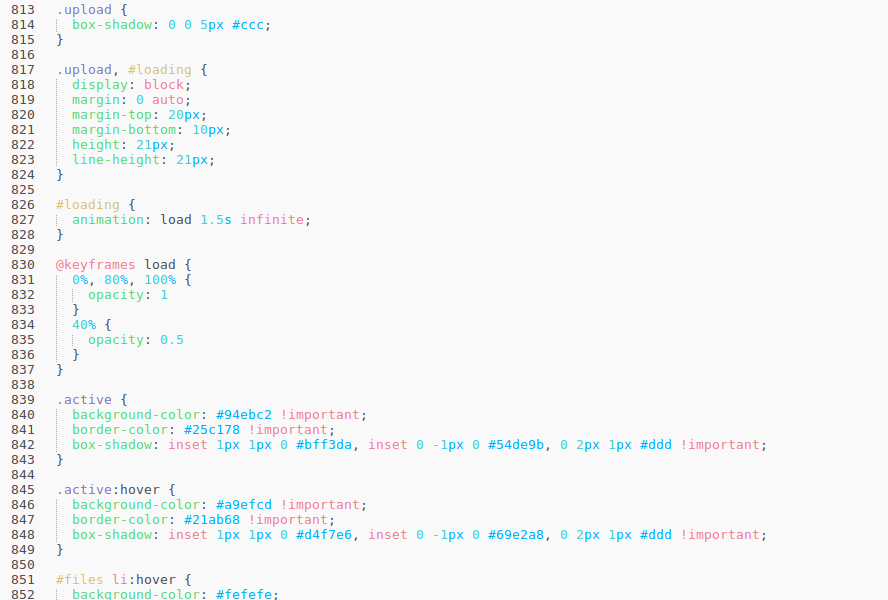
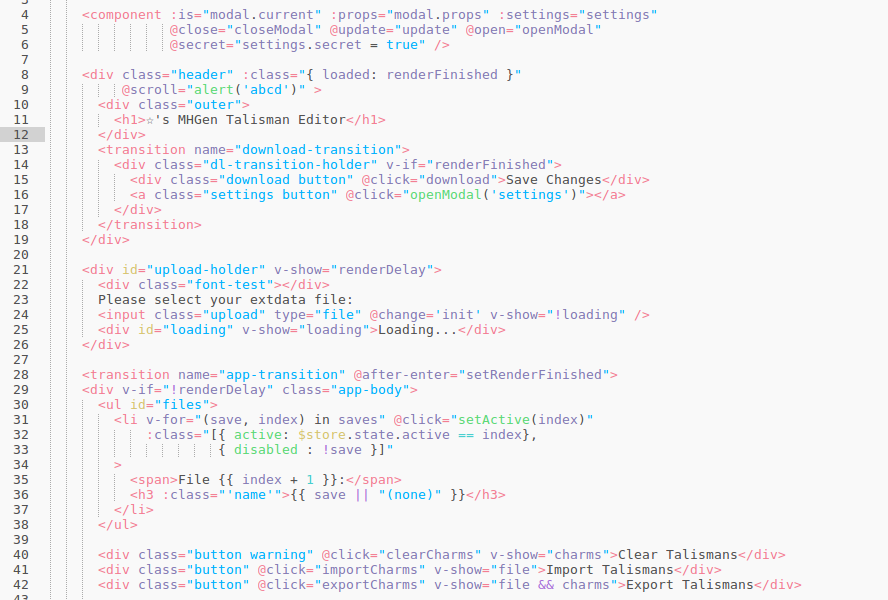
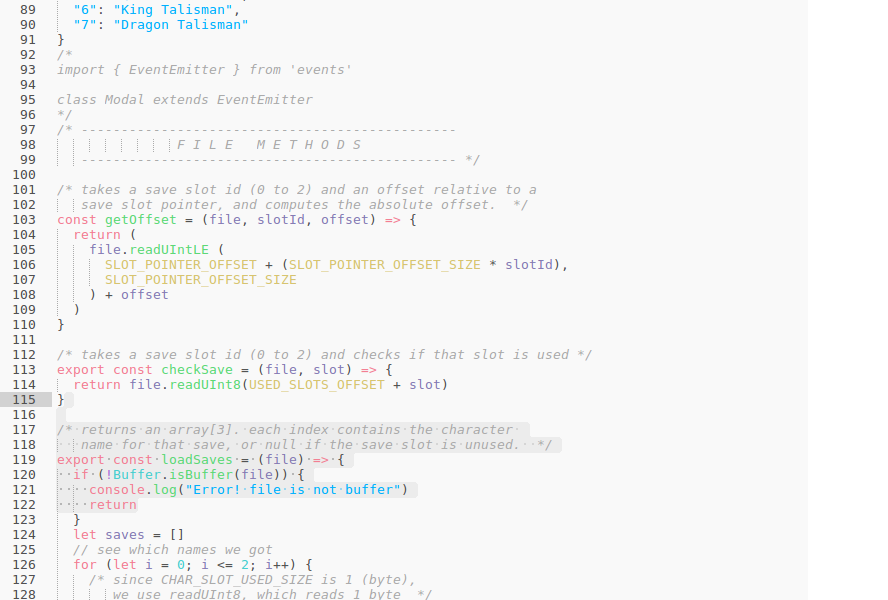
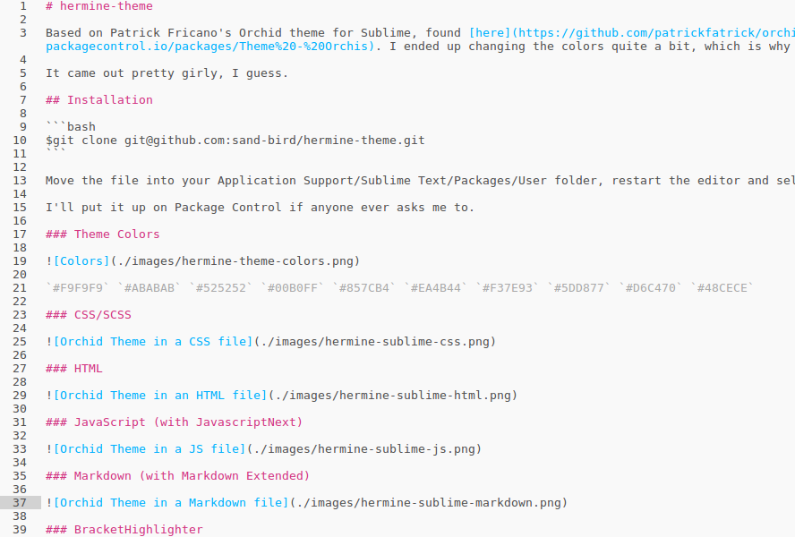

# hermine-sublime

A colorful (and kinda girly) color scheme for Sublime Text with a light background.

Based on Patrick Fricano's Orchid theme for Sublime, found [here](https://github.com/patrickfatrick/orchid-theme-sublime). I wanted a light version to go with [this theme](https://packagecontrol.io/packages/Theme%20-%20Orchis), and I liked Orchid, so I modified it. I ended up changing the colors quite a bit.

## Installation

```bash
$git clone git@github.com:sand-bird/hermine-theme.git
```

Move the file into your Application Support/Sublime Text/Packages/User folder, restart the editor and select the color scheme.

I'll put it up on Package Control if anyone ever asks me to.

### Theme Colors


`#F9F9F9` `#ABABAB` `#525252` `#00B0FF` `#857CB4` `#EA4B44` `#F37E93` `#5DD877` `#D6C470` `#48CECE`

### CSS/SCSS 



### HTML



### JavaScript (with JavascriptNext)



### Markdown (with Markdown Extended)



### BracketHighlighter

This should be unchanged but I don't feel like testing it. See [the original readme](https://github.com/patrickfatrick/orchid-theme-sublime/README.md) for info.
